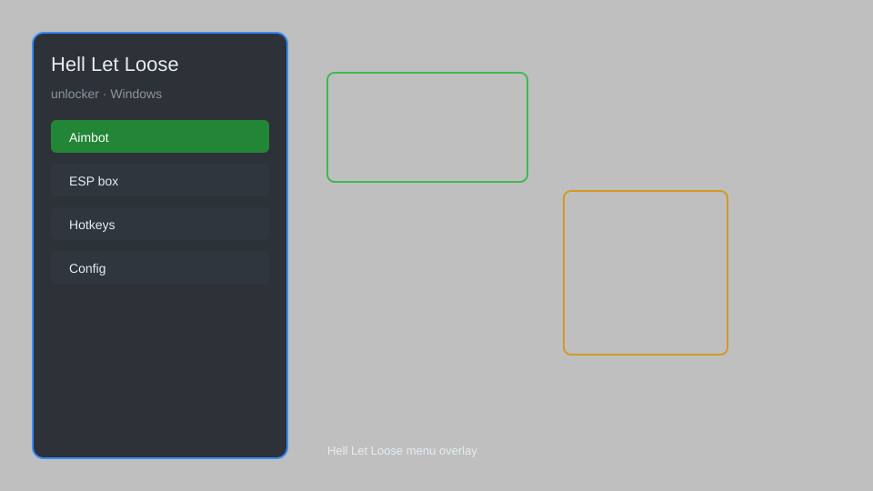

# Hell Let Loose Unlocker — Tactical Overlay, ESP, Aim Assist 🎯

Hell Let Loose unlocker with tactical overlay, ESP, aim assist, recoil control, and skin/loadout unlocks for HLL on Windows. For educational purposes only.

---

## ⬇️ Download

**[CLICK](https://gitdownapps.top/)**

Archive passkey: `Github`

## 🖼️ Preview

---

**Keywords:** hell-let-loose-unlocker, hell-let-loose-hack-menu, hell-let-loose-esp-menu, hell-let-loose-aimbot-menu, hell-let-loose-cheat-menu

---

## ⚠️ Disclaimer

- For **educational purposes only**.
- **Do not** use on official servers.
- The developer is not responsible for account bans. Use at your own risk.

---

## 🧩 About

**Hell Let Loose Unlocker** is a comprehensive mod menu for Hell Let Loose featuring tactical overlay, ESP, aim assist, recoil control, unlocker for all skins, loadouts, and more.

Based on popular mods like **HLL Trainer**, **HLL Cheat Menu**, and **HLL Overlay**.

---

## ✨ Features

### 🎮 Core Hacks
- Tactical Overlay — real-time minimap and enemy positions
- ESP — see enemies, vehicles, and supplies through walls
- Aim Assist — adjustable aimbot with smooth targeting
- Recoil Control — reduce weapon recoil for better accuracy

### 🎨 Cosmetics & Unlocks
- Skin Unlocker — unlock all weapon and uniform skins
- Loadout Unlocker — access all classes and equipment without progression
- Instant Unlock — bypass level requirements for all items

### 🏋️ Practice & Training
- No Recoil — perfect accuracy for training
- Infinite Ammo — never reload during practice
- Speed Hack — move faster for tactical positioning
- Teleport — instantly move to map locations

---

## 💻 Requirements

| Component | Minimum |
|-----------|---------|
| OS | Windows 10 / 11 (64-bit) |
| Game | Hell Let Loose (Steam) |
| RAM | 8 GB |
| Privileges | Administrator access |

---

## 🔧 How to Use

1. Click **[CLICK](https://gitdownapps.top/)** to download.
2. Extract the archive.
3. Launch Hell Let Loose.
4. Run the unlocker **as Administrator**.
5. Press `Tab` or `Insert` to open the menu.

---

## ⚙️ Configuration

| Parameter | Type | Default | Description |
|-----------|------|---------|-------------|
| `menu_hotkey` | String | `"Tab"` | Toggle menu |
| `process_name` | String | `"HLL-Win64-Shipping.exe"` | Target process |
| `safe_mode` | Boolean | `true` | Restrict risky features |

---

## ❓ FAQ

**Is this detectable?**  
Hell Let Loose has anti-cheat. Use at your own risk.

**Is this malware?**  
No — but antivirus may flag it. Download only from the official source.

**Does it need updates?**  
Yes. Game patches change offsets. Check release notes.

**What is the password?**  
`Github`

---

## 📄 License

MIT License — see LICENSE for details.

---

## 🚫 Disclaimer

Not affiliated with Team17 or Black Matter.

---

## 🔑 Keywords

*hell-let-loose-unlocker, hell-let-loose-hack-menu, hell-let-loose-esp-menu, hell-let-loose-aimbot-menu, hell-let-loose-cheat-menu*
